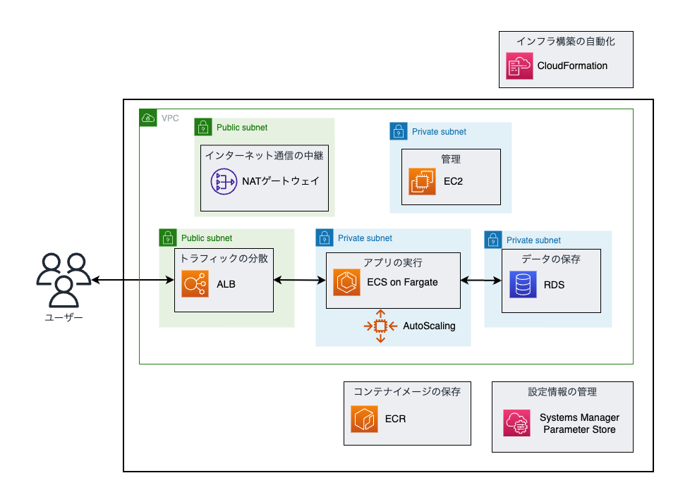

# クラウドエンジニア入門：AWS Fargate を使った Next.js アプリデプロイ

## 概要

この講座では、AWS の代表的なサービスである ECS を活用して、Next.js アプリケーションをデプロイし、オートスケーリングやログ管理、データベース管理の基礎を学びます。コンテナ技術を活用したアプリケーションの運用管理を実践的に学び、クラウドエンジニアとしての第一歩を踏み出しましょう。

## 構成図

以下は、今回作成するリソースの構成図になります。

## 学習内容

このハンズオンを通じて、以下のスキルを身につけることができます：

- **クラウドインフラの基本理解**
  - AWS の主要サービス（ECS, ALB, RDS, EC2 など）の役割と設定方法
- **コンテナ技術の理解**
  - Docker の基本操作、ECS 上でのコンテナ管理、マルチステージビルド
- **アプリケーションのデプロイとオートスケーリング**
  - Next.js アプリのデプロイ手順、オートスケーリング設定
- **AWS のインフラ自動構築**
  - CloudFormation を使ったインフラのコード化と管理
- **セキュアなアクセス管理とログ監視**
  - SSM セッションマネージャーを利用した EC2 アクセス、CloudWatch でのログ管理

## 注意事項

- **本講座で使用する AWS リソースには料金が発生します。** アカウント設定でコストのモニタリングを行うことをお勧めします。
- ハンズオン終了後は、作成したリソースを削除し、不要な料金が発生しないように注意してください。
